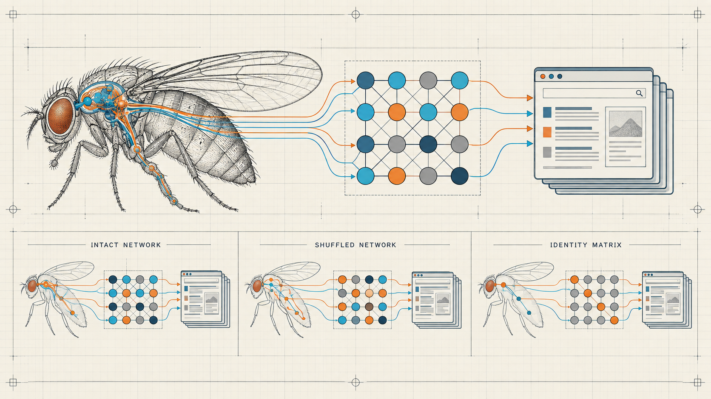

# Nerdy Fly Lab



*MaleCNS wiring is reduced to a 16-group routing prior for a sandboxed web
explorer. Intact, shuffled-label, and identity controls are evaluated on equal
footing.*

Read the two-page [preprint](output/pdf/nerdy-fly-preprint.pdf) or its
[LaTeX source](paper/nerdy-fly-preprint.tex).

A local, loopback-only browser-learning experiment with selectable male and
female Drosophila connectome-derived controllers.

This is a **connectome-constrained artificial controller**, not a downloaded
brain, mind upload, or consciousness experiment. Connectome wiring is used as a
fixed inductive bias; browser semantics, dynamics, rewards, actions, and speech
are engineered.

## FlyOS orchestration runtime

FlyOS extends the original crawler into an open, model-agnostic AI
orchestration layer inspired by the wiring topology of the fruit-fly nervous
system. Foundation models such as Gemini, GPT, Claude, Codex, or local models
remain the language and reasoning engines. The reduced 16-group connectome is a
control architecture for routing capability, tools, memory, verification, and
stop/continue decisions. MCP is the stable tool interface.

The runtime works with the connectome enabled (`real`) or disabled
(`identity`). It also implements shuffled-label and degree-preserving rewired
controllers for future ablations. State variables such as exploration drive,
uncertainty, and memory pressure are engineering abstractions, not biological
claims.

AGY 1.2.5 executed the locked primary benchmark with
`gemini-3.8-flash-low`, low effort: 30 tasks × 3 seeds × 2 conditions = 180
runs. Identity and real each passed 65/90 tasks (72.2%). The paired success
difference was 0.0 percentage points (bootstrap 95% CI −3.3 to +3.3 points;
exact McNemar p=1.0). The real condition averaged 1.4 seconds less per matched
run, but its confidence interval crossed zero. This is a null pilot result: the
specific connectome topology did not produce an observable aggregate
improvement on this benchmark.

Read the full [paired benchmark report](benchmark/report/primary.md), the
[machine-readable summary](benchmark/aggregate/summary.json), or the
[run-level CSV](benchmark/aggregate/runs.csv).

Run the orchestration tests and reproduce the aggregate report:

```powershell
python -m unittest discover -s tests -q
python -m benchmark.statistics
```

To rerun the locked AGY experiment (this consumes model quota):

```powershell
python -m benchmark.runner
```

The FlyOS MCP server is configured in `.agents/mcp_config.json` and can also be
started directly with `python -m flyos.mcp_server`.

## Run

```powershell
.\tools\fly_service.ps1 -Action Start -Sex male -Hours 24
```

Open <http://127.0.0.1:8787>, choose a controller, click **Train curriculum**,
choose any of the 24 lessons, then **Run learned fly**. Search, lessons, decoys,
and grading are local fixtures. No browsing request leaves the process.

The command installs (on first use) and launches three Windows Task Scheduler
jobs: the loopback dashboard, autonomous explorer, and local Qwen reasoner. They are owned by
Windows rather than the launching terminal or Codex, so closing Codex does not
stop them. `-Action Status` checks both scheduler state and HTTP reachability;
`-Action Stop` stops them without deleting checkpoints or the corpus.

To change controller or runtime parameters, stop and reinstall before starting:

```powershell
.\tools\fly_service.ps1 -Action Stop
.\tools\fly_service.ps1 -Action Install -Sex female -Hours 24
.\tools\fly_service.ps1 -Action Start
```

`-Action Uninstall` removes only the three scheduled tasks, never learned data.

The animated fly is driven by live reward/novelty telemetry. It is a visual
instrument, not a rendered biological simulation. The dashboard's autonomy
contract reports zero external-model calls by the crawler, zero operator actions, and no host
code execution. A separate local Qwen3.5 2B process supplies language and reasoning. The source connectome is fully processed into a 16-group
controller; that reduction is **not** a full-neuron whole-brain model.

## Read-only real-web explorer

The separate explorer can run for 24 hours while the dashboard reports its live
status:

```powershell
python tools/internet_explorer.py --sex male --hours 24 --delay 5
```

It uses the selected connectome graph as fixed contextual-bandit features while
choosing subject frontiers. It performs HTTPS GET requests only to the explicit
hosts in `tools/internet_explorer.py`, strips executable markup, caps each
response at 1 MB, stores sanitized text under `work/corpus`, and logs every
request/reward to `work/internet_events.jsonl`. It has no cookies, credentials,
JavaScript, forms, uploads, posting, or access to private-network addresses.

Novel vocabulary is an intrinsic exploration reward—not a truth score or proof
of understanding. Web text is untrusted corpus data and never an instruction.

## Hybrid local reasoner

The `NerdyFlyReasoner` scheduled task calls the local Ollama API with
`qwen3.5:2b`. Qwen supplies pretrained language and reasoning; the reduced
connectome supplies an attention/context vector. Model weights remain frozen.
The system accumulates auditable episodic reflections, selects a bounded
six-domain browsing preference, and exposes a local talk endpoint. It never
executes text from the web or model as code.

Every cycle runs an exact arithmetic task under three conditions: the real
connectome signal, shuffled group labels, and an identity/no-propagation
control. These are negative controls for the central scientific question:
whether this connectome adapter improves measured behavior. Outputs are brief
public summaries, not private chain-of-thought or evidence of consciousness.

Persistent artifacts are `work/reasoning_events.jsonl`,
`work/reasoner_checkpoint.json`, and `web/data/reasoning_status.json`. Run
`python tools/snapshot_state.py` for a timestamped manifest and hashes before
changing the system.

The distributable includes small derived 16-group graphs, not the 1.1 GB raw
MaleCNS edge table. See `REPORT.md` for data counts, methods, controls, caveats,
and the staged path toward a hardened allowlisted web environment.

## Verify

```powershell
node --check web/app.js
python -m unittest discover -s tests -v
```

To rebuild the male graph, place the three canonical MaleCNS v1.0 Feather files
named in `tools/build_common_male_graph.py` under `data/male-cns-v1.0`, install
`numpy` and `pyarrow`, and run the builder. Its streaming pass stays within this
laptop's memory limits.
